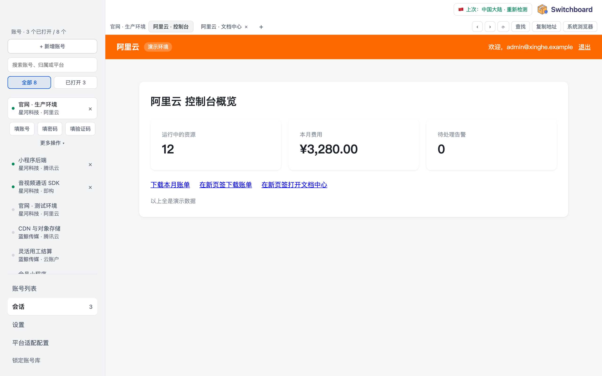
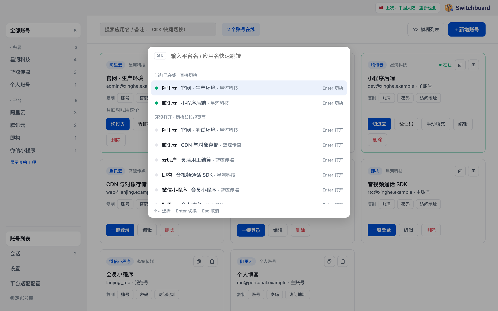
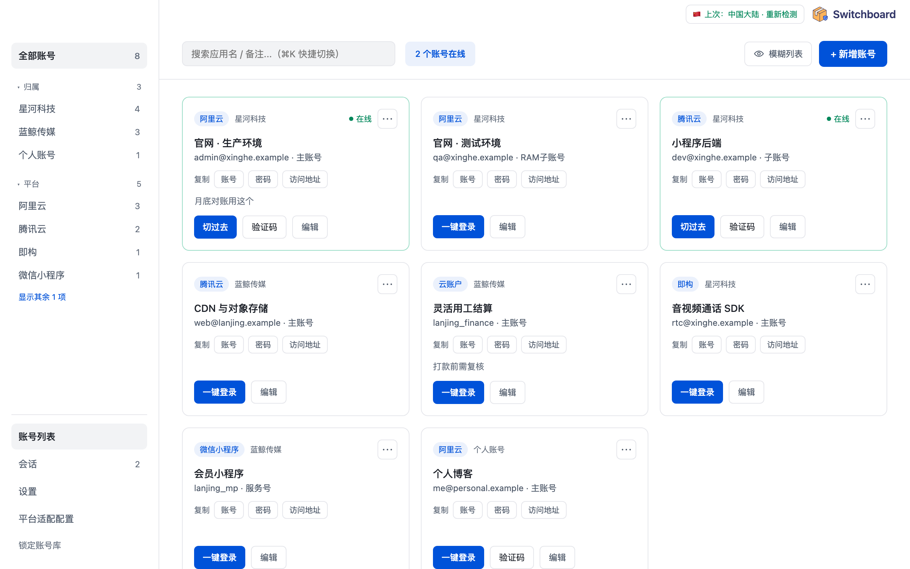
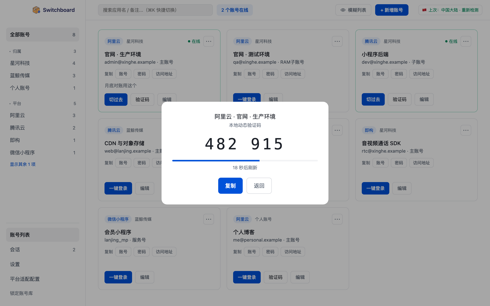

# Switchboard

多云平台账号管理器 —— 集中保存各平台（阿里云、腾讯云、即构、微信小程序等）的账号，一键登录、切换会话、本地生成 TOTP 验证码。

## 功能特点

> 下面的截图全部是演示模式的假数据。

### 同一个厂商的多个账号，同时在线

以前：公司的阿里云、个人的阿里云、测试环境的 RAM 子账号……要么开好几个浏览器 / 无痕窗口 / 浏览器用户，要么登了这个退那个。

现在：**每个账号一个完全隔离的登录环境**（独立的 cookie、LocalStorage、缓存），同一个厂商开十个账号也互不串号。
全部嵌在一个窗口里，左边点哪个账号右边就是哪个，⌘K 搜名字秒切换，不用在一堆浏览器窗口里找。





### 账号分类与查找

- 按**归属**（公司 / 个人 / 客户……自己起名）和**平台**两个维度分组，侧栏点一下就筛出来，带数量
- 每个账号记着关联应用 / 项目、账号角色（主账号、RAM 子账号……），搜应用名、备注、登录名都能搜到
- 平台、归属、角色、登录地址填过一次就进下拉候选，同类账号「复制新建」改两个字段就行
- 除了账号密码，还能加任意**附加字段**（企业主体、AppID、密钥……），可标记为敏感
- 「截图模糊」一键把列表打码，给别人看界面不漏信息



### 一键登录

- 点账号直接打开它的登录直达页，**自动填好账号密码**
- 新平台不认识输入框？点「指认输入框」在页面上点一下账号框、一下密码框，记住后同平台都自动填
- 填不进去的站（软键盘、奇怪的控件）：点一下页面上的框，再点「填账号 / 填密码 / 填验证码 / 填附加字段」，值同时进剪贴板兜底
- 「设为直达页」：把当前停的页面存成这个账号的登录地址，下次直接开到这
- 「清除登录状态」：网站上退出后不想再被自动登回去，一键清掉
- **登录态自动保留**：退出、锁定时把 cookie 加密存起来，下次打开直接是登录状态
- **保活**：登录一会不动就过期的站（比如云账户），在会话页左栏勾「保活」，页面开着时这个账号 3 分钟没操作就自动刷新一次。按账号单独开，默认网络异常（区域检测判为要拦）时暂停，允许境外访问的账号可以再勾「网络异常时也保活、不断开」：不管网络怎样都保活，区域拦截也不断开它（等于你同意这个账号走境外网络）。锁定（包括自动锁定）时这些账号的页面不关，藏在锁屏后面接着刷，解锁回来还在线；只有退出 App 才停
- 平台适配可以导出 / 导入，新平台按提示词让 AI 生成配置导入即可，不用重新打包

### 像浏览器一样用

- 页面自己开的新窗口变成**页签**，OAuth 那种弹窗照常工作
- **在账号里打开任意地址**：别人发来一个要登录才能看的文档链接，在页签条上点 `+` 粘贴，带着这个账号的登录态直接看
- **页内查找**（⌘F）：高亮所有匹配，回车逐个跳转
- 前进、后退、刷新、复制地址、交给系统浏览器打开
- 下载落到指定文件夹（或每次问保存到哪），完成后一点就在访达里找到
- 页面里的拖拽上传照常能用
- 页面打不开**直接说原因**（限了 IP、404、服务没在跑、超时），不是一块白板

### 本地 TOTP 验证码

存了 TOTP 密钥的账号直接出 6 位动态码，不用掏手机。密钥可以粘贴 `otpauth://` 链接、选二维码图片，或者（macOS）直接截图二维码再粘贴。



### 安全

- 整个账号库用**主密码**经 SQLCipher 加密，没有后门，主密码不出本机
- 复制明文（密码、验证码、整条账号）要再验一次主密码，**30 秒后自动清空剪贴板**
- 空闲自动锁定（时长可调）；锁定时顺手抹掉 WebKit 留在磁盘上的登录数据
- 自动填充只在登录站、页面打开后 2 分钟内生效，不会填到别的站或「修改密码」框里
- **网络区域检测**：检测到境外出口 / 代理 / VPN 时拦下，或直接切断已打开的页面，网络恢复后自动接回（见 [NETWORK-GUARD.md](docs/NETWORK-GUARD.md)）
- 加密备份导出 / 导入，换机器不丢数据

### 其他

- **演示模式**：一套假账号 + 本机模拟登录页，给别人演示不碰真实数据，还能一键自动演示并录屏
- 在线更新（安装包带签名校验）
- 跟随系统外观自动切换深色模式
- macOS（Apple Silicon / Intel 通用包）；Windows 版已适配，还没在真机上完整跑过

## 目录

- [RELEASE.md](docs/RELEASE.md) —— 发版手册：打包、发布到 Gitee、在线更新、常见报错，以及 Windows 版怎么出包、和 macOS 有哪些区别
- [NETWORK-GUARD.md](docs/NETWORK-GUARD.md) —— 网络区域检测：为什么要有、怎么判、实测数据
- [ENCRYPTION.md](docs/ENCRYPTION.md) —— 加密与数据安全：账号库怎么加密、解锁 / 锁定 / 备份 / 恢复时各发生什么、挡得住什么挡不住什么、改代码的红线
- [prototype-design.md](docs/prototype-design.md) —— 设计与架构：原型屏幕清单、流程，以及 Tauri + 内嵌 WebView 的技术架构
- [prototype/](docs/prototype/) —— 21 个可交互的静态原型页面（`.dc.html`）
- `src/` —— 前端（React + Vite + TS）
  - `App.tsx` 只做路由；`screens/Layout.tsx` 放全局顶栏、左侧导航等共用壳；`ui.tsx` 是配色和几个基础组件
- `src-tauri/src/` —— Rust 后端
  - `db.rs` 加密库与所有 SQL ｜ `session.rs` 会话（子 webview 的创建/摆放/显隐）｜ `adapter.rs` 注入登录页的那几段 JS ｜ `totp.rs` 验证码 ｜ `lib.rs` 全部 Tauri 命令

## 开发

```bash
pnpm install
pnpm tauri dev
```

打包：`pnpm tauri build`。跑后端单测：`cargo test --manifest-path src-tauri/Cargo.toml`。

## 数据存在哪

| | macOS | Windows |
|---|---|---|
| 数据目录（账号库 `switchboard.db`、设置） | `~/Library/Application Support/com.switchboard.app/` | `%APPDATA%\com.switchboard.app\`（即 `C:\Users\<用户名>\AppData\Roaming\com.switchboard.app\`） |
| 各账号页面的登录数据（cookie、LocalStorage 等） | `~/Library/WebKit/com.switchboard.app/WebsiteDataStore/<账号 id>` | 数据目录下的 `profiles\<账号 id>\` |
| 下载的文件 | 系统「下载」目录，「设置 → 下载」可改 | 同左 |

账号库整库由主密码经 SQLCipher 加密，忘记主密码无法找回。开发版在数据目录下的 `dev/`，演示模式再往下一层 `demo/`。

## 实现进度

- [x] 主密码建库/解锁/修改，账号列表（含空态与搜索兜底）、新增/编辑/删除
- [x] 会话管理：每个账号一个隔离的内嵌页面（嵌在主窗口右侧，页面自己开的新窗口变页签），⌘K 快捷切换
- [x] 自动填充 + 手动指认输入框（选择器自动写回平台配置）
- [x] 本地 TOTP、加密备份导出/导入、平台适配配置界面
- [x] 会话 cookie 快照：退出时抄一份进加密库，下次打开塞回去，免得每次重登
- [x] 在线适配：新平台不用重新打包，按提示词让 AI 生成 JSON 导入即可（设置页右上角 `?`）
- [x] 网络区域检测：非中国大陆出口时拦截打开（港澳台同样按境外处理），见 [NETWORK-GUARD.md](docs/NETWORK-GUARD.md)
- [ ] Windows 版：代码已按 WebView2 适配，安装包在 Mac 上交叉编译（见 [RELEASE.md「Windows 版」](docs/RELEASE.md)），还没在真机上完整跑过
- [ ] 未做：多设备同步、移动端、选择器失效主动告警

## 开发版与正式版

两者**数据完全分开**，`pnpm tauri dev` 调试不会碰到你日常在用的账号库：

| | macOS 数据目录 | Windows 数据目录 | 窗口标题 |
|---|---|---|---|
| 开发版 | `~/Library/Application Support/com.switchboard.app/dev/` | `%APPDATA%\com.switchboard.app\dev\` | Switchboard（开发版 · 独立数据目录） |
| 正式版 | `~/Library/Application Support/com.switchboard.app/` | `%APPDATA%\com.switchboard.app\` | Switchboard |

账号库、`owner.txt`、各账号的隔离目录都从同一个根派生（`data_dir()`），只要这一处分开，其余自动跟着分。

**同一时刻只能运行一个实例**（`tauri-plugin-single-instance`）。重复启动不会开新窗口，而是把已经在跑的那个提到前台——两个进程同时抓同一个 SQLCipher 库和同一份 WebKit 数据仓，轻则 cookie 快照互相覆盖，重则写坏库。

## 演示模式

给别人看功能时用：登录页 / 创建账号页底部点「进入演示模式」。

- 换到独立的 `demo/` 数据目录，每次进入都清空重建一套假账号（阿里云、腾讯云、云账户、即构、微信小程序），**真实账号库不碰**
- 登录页全是 App 在 `127.0.0.1` 上现做的模拟页，不连外网；输入框照着各平台的默认选择器做，演示的是真实的自动填充链路
- 区域检测在演示库里默认关（一个探测请求都不发），下载落在演示目录里，归属下拉框也不出现真实名字
- 演示库主密码 `demo`（复制明文时要输），顶栏有橙色标记；**锁定即退出**，回到真实账号库
- 「▶ 一键自动演示」：从全新假库开始自动走一遍（账号库 → 一键登录 → 多账号并行 → 切换 → TOTP → ⌘K），约 30 秒，顶栏有解说字幕，随时可停。脚本在 `App.tsx` 的 `runTour`
- 勾「录屏」会用系统自带的 `screencapture` 只录本窗口、按总时长定时录，存到「影片」并在访达中选中。首次要在「系统设置 → 隐私与安全性 → 录屏与系统录音」里允许 Switchboard，授权后重开 App；录之前建议开勿扰模式，免得通知弹进窗口区域

## 登录态为什么能留住

登录态 cookie 大多是**会话 cookie**（不带过期时间），WebView 一关就没，这是浏览器规范行为。所以 App 会把 cookie 抄进加密库，下次打开塞回去。

抄快照的时机有三个，**不能只靠退出事件**：macOS 上 Cmd+Q 走的是 `NSApplication terminate:`，不经过"最后一个窗口被销毁"，`RunEvent::ExitRequested` 根本不会触发，强杀和崩溃就更不会。

1. 每 120 秒定时抄一次（兜底，最坏丢最近两分钟）
2. 关闭单个会话、锁定账号库时
3. 退出事件（`ExitRequested` / `Exit`）

**锁定时会抹掉 WebKit 留在磁盘上的登录数据**（`lock_down`）。长期有效的 cookie、LocalStorage、IndexedDB
是浏览器内核自己以明文存的，macOS 上在 `~/Library/WebKit/<bundle id>/WebsiteDataStore/<账号 id>`（不在我们的数据目录里），Windows 上在数据目录下的 `profiles\<账号 id>\`；
不抹的话锁不锁库都能被捡走。锁上之后磁盘上只剩加密库里的 cookie 快照，下次打开由它接回登录态。
代价：把登录凭证放在 LocalStorage 里的站，锁一次要重新登一次。⌘Q 退出不走锁定，登录数据留到下次锁定时抹。
删除账号、清空账号库时同样会抹掉对应的登录数据。
开了「保活」的账号是例外：锁定时它的页面留着、登录数据不抹，这是按账号自己勾的。
完整的加密与数据安全设计见 [ENCRYPTION.md](docs/ENCRYPTION.md)。

## 发布

```bash
python3 scripts/release.py
```

交互式菜单，会问你要做什么（发布 / 只构建 / 直接上传 / 改版本号），不用记参数。
macOS 和 Windows 两个平台的包都在 Mac 上打，发布时默认两个一起发，也可以只发其中一个。
两台机器各要装什么见 [RELEASE.md「打包环境」](docs/RELEASE.md#打包环境)。
令牌、签名密钥、版本号规则、在线更新原理、常见报错 —— 全在 **[docs/RELEASE.md](docs/RELEASE.md)**。

## 几个容易踩的点

- **一键登录跳哪，只看账号自己的「登录直达 URL」**，跟平台无关。平台只决定自动填充用哪两个选择器。
- 自动填充没填上时，到「会话」页点一下页面里的输入框，再点左边的「填账号 / 填密码」——这条路不依赖任何选择器。填进去的值同时进剪贴板，30 秒后自动清掉。
- 自动填充只在页面**打开或刷新后 2 分钟内**生效：登录后在控制台里到处点，"修改密码"之类的框不会被填上。登录过期被踢回登录页时点一下「刷新」就又管用了。
- 平台「其他」底下常挂着互不相干的自建站，它的输入框选择器**按站点单独存**（平台适配配置里显示为「其他 · 主机:端口」），别的平台照旧按平台名共用一套。没账号在用的配置可以在编辑框里删掉（内置平台不能删）。
- 页签里下载的文件默认存系统「下载」目录，「设置 → 下载」里可以换文件夹，也可以打开「每次下载都问保存到哪」（下完弹保存框另存）。macOS、Windows 一样。
- 在网站上退出登录后，再打开账号又被自动登回去：到会话页点「清除登录状态」，会删掉保存的 cookie 快照和本机登录数据。
- macOS 上 `window.alert / confirm / prompt` 是**静默失效**的（wry 没实现 WKWebView 的 JS 弹窗代理），所有确认框都得自己画。
- 如果网络探测出问题那就改 `REGION_WATCH_SECS`

## 忘记主密码

主密码就是账号库的加密密钥，没有后门。强制重置只能在数据目录里手动执行，
登录页的「忘记主密码」里有可复制的完整命令：

```bash
cd ~/Library/Application\ Support/com.switchboard.app && /Applications/Switchboard.app/Contents/MacOS/Switchboard reset
```

Windows 上给的是一条 PowerShell 命令（作用一样，在 `%APPDATA%\com.switchboard.app\` 里操作），同样从登录页复制，到 PowerShell 里执行。

它把旧库改名归档（仍是加密的，密码想不起来就解不开），App 重开后回到「创建主账号」。

## 本地预览原型

```bash
cd docs/prototype && python3 -m http.server 8777
```

打开 <http://localhost:8777/> ，即 [docs/prototype/index.html](docs/prototype/index.html)：

- 总览：所有页面的缩略图，点卡片进入单页
- 单页：`←` `→` 键或顶部按钮左右切换，右上下拉框直接跳转，`Esc` 回总览
- 页面内的链接照常跳转，顶部的页码会跟着同步
- 窗口小于 1280×800 时自动等比缩放

需用 HTTP 打开（直接双击 `file://` 不执行脚本，`Main.dc.html` 的账号列表会渲染不出来）。

## 原型页面

| 分组 | 页面 |
| --- | --- |
| 入口 | 注册主账号、登录、空状态引导 |
| 主流程 | 账号列表、新增/编辑账号、一键登录反馈、本地验证码、删除确认 |
| 会话 | 活跃会话总览、会话过期-手动验证、快捷切换面板、切换后视图（阿里云/腾讯云） |
| 业务流程 | 无会话自动填充、手动指认输入框、会话有效直接进入 |
| 配置 | 设置页、平台适配配置、字段候选/新建交互、备份导出确认、搜索无结果 |

## 说明

`.dc.html` 是设计工具导出的格式，用 `{{表达式}}`、`<sc-for>`、`<sc-if>` 做数据绑定。[docs/prototype/support.js](docs/prototype/support.js) 是为本地预览补的极简运行时（约 60 行），仅供看原型用。

## 许可证

[MIT](LICENSE) © 2026 tan
